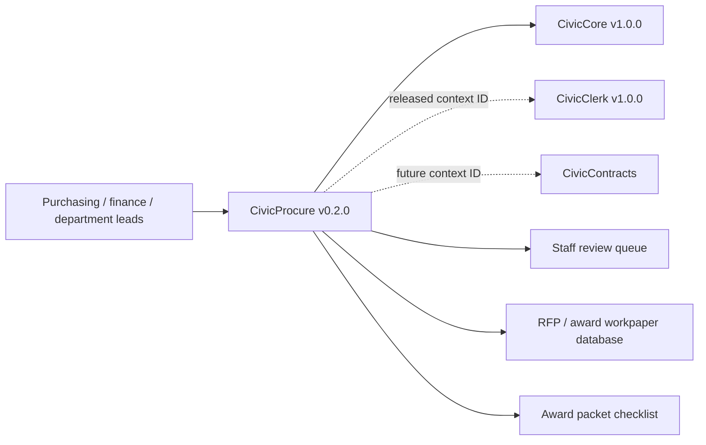

# CivicProcure User Manual

## For Non-Technical Users

CivicProcure helps city staff keep solicitation drafts, proposal notes, exception flags, scoring summaries, staff review queues, board memo inputs, CivicClerk/CivicContracts context references, and award-packet records organized. It can draft an RFP outline, scaffold proposal comparison rows, flag common exception language, build a scoring summary, and assemble an award-packet checklist.

Current state: 0.2.0 procurement support and staff review queue runtime. CivicProcure can optionally save generated RFP drafts, award-packet checklists, and staff review queue records when IT configures a workpaper database. Staff-only review routes also require `CIVICPROCURE_STAFF_API_KEY`. CivicProcure does not provide official vendor evaluation decisions, legal advice, live vendor portals, live LLM calls, e-procurement submission portals, award decisions, or procurement system-of-record updates. Staff own every decision.

## For IT and Technical Staff

CivicProcure is a FastAPI Python package pinned to the published `civiccore v1.0.0` release wheel. The current runtime exposes:

- `GET /`
- `GET /health`
- `GET /civicprocure`
- `POST /api/v1/civicprocure/rfps/draft`
- `GET /api/v1/civicprocure/rfps/draft/{draft_id}`
- `POST /api/v1/civicprocure/proposals/compare`
- `POST /api/v1/civicprocure/proposals/exceptions`
- `POST /api/v1/civicprocure/scoring/summary`
- `POST /api/v1/civicprocure/award-packet`
- `GET /api/v1/civicprocure/award-packet/{packet_id}`
- `POST /api/v1/civicprocure/context/procurement-review`
- `POST /api/v1/civicprocure/integrations/mock/procurement-context`
- `POST /api/v1/civicprocure/staff/reviews`
- `GET /api/v1/civicprocure/staff/reviews`
- `PATCH /api/v1/civicprocure/staff/reviews/{review_id}`
- `GET /api/v1/civicprocure/staff/reviews/summary`

Optional persistence is controlled by `CIVICPROCURE_WORKPAPER_DB_URL`. Staff queue routes also require `CIVICPROCURE_STAFF_API_KEY`, `X-CivicProcure-Role: staff` or `service`, and `X-CivicProcure-Staff-Key` matching the configured key.

Run:

```bash
python -m pip install https://github.com/CivicSuite/civiccore/releases/download/v1.0/civiccore-1.0.0-py3-none-any.whl
python -m pip install -e ".[dev]"
python -m pytest -q
bash scripts/verify-release.sh
```

## Architecture



CivicProcure depends on CivicCore. CivicCore does not depend on CivicProcure. CivicProcure v0.2.0 uses deterministic sample procurement data plus optional staff-gated persistence, review-required context packets for CivicClerk/CivicContracts references, staff review queue records, and adversarial local mocks for integration-depth validation.
