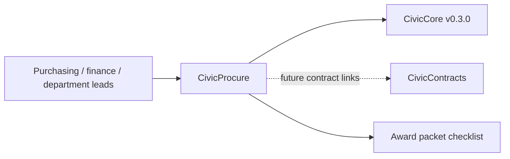

# CivicProcure User Manual

## For Non-Technical Users

CivicProcure helps city staff keep solicitation drafts, proposal notes, exception flags, scoring summaries, board memo inputs, and award-packet records organized. It can draft a sample RFP outline, scaffold proposal comparison rows, flag common exception language, build a scoring summary, and assemble an award-packet checklist.

Current state: `0.1.1` procurement support foundation release. CivicProcure does not provide official vendor evaluation decisions, legal advice, live vendor portals, live LLM calls, e-procurement submission portals, awards, or procurement system-of-record updates. Staff own every decision.

## For IT and Technical Staff

CivicProcure is a FastAPI Python package pinned to `civiccore==0.3.0`. The current runtime exposes:

- `GET /`
- `GET /health`
- `GET /civicprocure`
- `POST /api/v1/civicprocure/rfps/draft`
- `POST /api/v1/civicprocure/proposals/compare`
- `POST /api/v1/civicprocure/proposals/exceptions`
- `POST /api/v1/civicprocure/scoring/summary`
- `POST /api/v1/civicprocure/award-packet`

Run:

```bash
python -m pip install -e ".[dev]"
python -m pytest -q
bash scripts/verify-release.sh
```

## Architecture



CivicProcure depends on CivicCore. CivicCore does not depend on CivicProcure. CivicProcure v0.1.1 uses deterministic sample procurement data only; live vendor portals, CivicContracts links, staff review queues, and production procurement-system integrations are future work.
